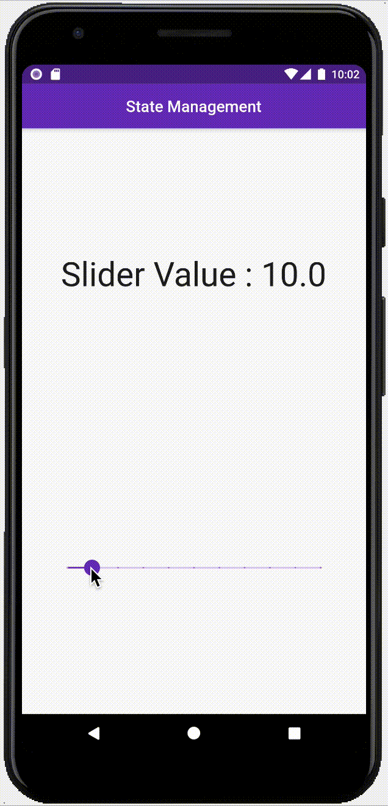
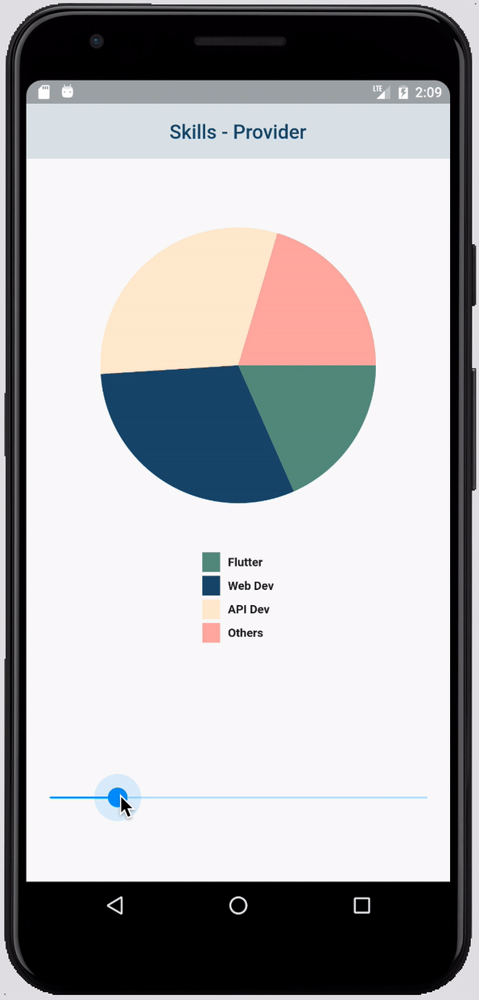

# Progmatic State Management in Flutter

 
 	&nbsp; 	&nbsp; 	&nbsp; 	&nbsp; 	&nbsp; 	&nbsp;
   
 

**Left Demo :** 

- 01 Noobs Approach - Not Recommended
- 02 Lifting Up State - Provider v3.x

**Right Demo :** 

- 03 Lifting Up State - UPDATE - Provider v4

## Goal

Change Slider Indicator Value (top) when slider is _dragged_. We want to notify Slider Indicator to show current position of slider.

## We have two methods here

1. **The Noobs Approach** of changing updating states. In this we store state of widget (slider value indicator at top) globally and then use that global copy to change state inside slider widget. This approach would give hiccups when there are multiple widgets trying to change single widget. Not recommended approach. But you can get started with it very easily!

2. **Lifting Up State** approach, in this we separate our model i.e. slider value from Widgets; making UI and Data independent of each other. This is also easy to implement. Also, this method is considered good practice after BLoC pattern (We would talk about it later...)

BLoC pattern is considered the ideal approach of all. But it becomes difficult to implement and people actually stops learning flutter (quite difficult for begginers). 

The Code for both approaches are above, feel free to clone and use them. I have kept them fairly simple to understand. _"There is nothing fancier here."_

#### 

**Inspired from Google I/O 19 - Pragramatic State Management** : [Youtube Link](https://youtu.be/d_m5csmrf7I)

